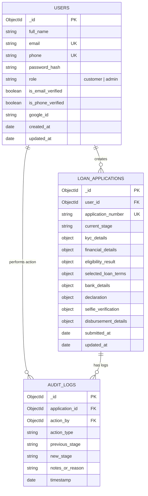

# EZFinanz Personal Loan Application Solution - Database Schema Specification

## 1. Entity-Relationship Diagram (ERD)



---

## 2. Collection Schemas & Mongoose Code Definitions

### 2.1 Collection: `users` (`backend/models/User.js`)

Stores account credentials, profile basics, verification flags, and role (`customer` or `admin`).

```javascript
const mongoose = require('mongoose');

const UserSchema = new mongoose.Schema({
  fullName: {
    type: String,
    required: [true, 'Full name is required'],
    trim: true,
    maxlength: 100
  },
  email: {
    type: String,
    required: [true, 'Email is required'],
    unique: true,
    lowercase: true,
    trim: true,
    match: [/^\w+([.-]?\w+)*@\w+([.-]?\w+)*(\.\w{2,3})+$/, 'Please provide a valid email']
  },
  phone: {
    type: String,
    required: [true, 'Phone number is required'],
    unique: true,
    trim: true,
    match: [/^[6-9]\d{9}$/, 'Please provide a valid 10-digit Indian phone number']
  },
  password: {
    type: String,
    required: function() { return !this.googleId; }, // Required unless OAuth
    minlength: 8
  },
  role: {
    type: String,
    enum: ['customer', 'admin'],
    default: 'customer'
  },
  isEmailVerified: {
    type: Boolean,
    default: false
  },
  isPhoneVerified: {
    type: Boolean,
    default: false
  },
  emailOtp: {
    code: String,
    expiresAt: Date
  },
  phoneOtp: {
    code: String,
    expiresAt: Date
  },
  googleId: {
    type: String,
    default: null
  }
}, {
  timestamps: true
});

UserSchema.index({ email: 1, phone: 1 });

module.exports = mongoose.model('User', UserSchema);
```

---

### 2.2 Collection: `loanapplications` (`backend/models/LoanApplication.js`)

Central schema recording all 10 application steps, identity details, eligibility rating, calculated EMI & IRR terms, bank account data, declaration, selfie photo paths, admin audit decisions, and final disbursement status.

```javascript
const mongoose = require('mongoose');

const LoanApplicationSchema = new mongoose.Schema({
  applicationNumber: {
    type: String,
    required: true,
    unique: true,
    default: () => `EZF-${Date.now()}-${Math.floor(1000 + Math.random() * 9000)}`
  },
  user: {
    type: mongoose.Schema.Types.ObjectId,
    ref: 'User',
    required: true,
    unique: true // One active application per user
  },
  currentStage: {
    type: String,
    enum: [
      'DRAFT',
      'EMAIL_VERIFIED',
      'PHONE_VERIFIED',
      'KYC_SUBMITTED',
      'ELIGIBILITY_CALCULATED',
      'LOAN_TERMS_SELECTED',
      'BANK_DETAILS_ADDED',
      'DECLARATION_ACCEPTED',
      'UNDER_ADMIN_REVIEW',
      'SELFIE_APPROVED',
      'SELFIE_REJECTED',
      'DISBURSED',
      'REJECTED'
    ],
    default: 'DRAFT',
    required: true
  },
  
  // Step 3: KYC Details
  kyc: {
    fullName: String,
    dob: Date,
    age: Number,
    gender: { type: String, enum: ['Male', 'Female', 'Other'] },
    address: {
      line1: String,
      line2: String,
      city: String,
      state: String,
      pincode: String
    },
    idType: { type: String, enum: ['PAN', 'Aadhaar'] },
    idNumber: String,
    documentPath: String, // Optional uploaded ID photo
    isVerified: { type: Boolean, default: false }
  },

  // Step 4: Financial & Eligibility Engine
  financials: {
    monthlyIncome: Number,
    requestedAmount: Number,
    cibilScore: Number,
    existingDebts: Number,
    employerName: String,
    designation: String
  },
  eligibility: {
    status: { type: String, enum: ['ELIGIBLE', 'PARTIALLY_ELIGIBLE', 'NOT_ELIGIBLE'] },
    dtiRatio: Number,
    riskRating: String,
    maxApprovedAmount: Number,
    applicableInterestRate: Number,
    reason: String,
    calculatedAt: Date
  },

  // Step 5: Loan Customization & Terms
  selectedTerms: {
    amount: Number,
    tenureMonths: Number,
    interestRate: Number,
    monthlyEmi: Number,
    processingFee: Number,
    gst: Number,
    documentationFee: Number,
    totalDeductions: Number,
    netDisbursementAmount: Number,
    totalInterest: Number,
    totalRepayment: Number,
    monthlyIrr: Number,
    annualNominalIrr: Number,
    annualEffectiveIrr: Number,
    lockedAt: Date
  },

  // Step 6: Bank Details
  bankDetails: {
    accountHolderName: String,
    accountNumber: String,
    ifscCode: String,
    bankName: String,
    accountType: { type: String, enum: ['Savings', 'Current'] },
    isVerified: { type: Boolean, default: false }
  },

  // Step 7: Declaration
  declaration: {
    accepted: { type: Boolean, default: false },
    acceptedAt: Date,
    ipAddress: String
  },

  // Step 8: Live Selfie / Photo
  selfie: {
    photoPath: String,
    uploadedAt: Date,
    status: { type: String, enum: ['PENDING', 'APPROVED', 'REJECTED'], default: 'PENDING' },
    rejectionReason: String,
    reviewedBy: { type: mongoose.Schema.Types.ObjectId, ref: 'User' },
    reviewedAt: Date
  },

  // Step 10: Disbursement Details
  disbursement: {
    utrNumber: String,
    disbursedAmount: Number,
    disbursedAt: Date,
    disbursedBy: { type: mongoose.Schema.Types.ObjectId, ref: 'User' }
  }
}, {
  timestamps: true
});

LoanApplicationSchema.index({ currentStage: 1 });
LoanApplicationSchema.index({ applicationNumber: 1 });

module.exports = mongoose.model('LoanApplication', LoanApplicationSchema);
```

---

### 2.3 Collection: `auditlogs` (`backend/models/AuditLog.js`)

Maintains an immutable historical record of all state transitions, admin reviews, and disbursement confirmations.

```javascript
const mongoose = require('mongoose');

const AuditLogSchema = new mongoose.Schema({
  application: {
    type: mongoose.Schema.Types.ObjectId,
    ref: 'LoanApplication',
    required: true
  },
  actionBy: {
    type: mongoose.Schema.Types.ObjectId,
    ref: 'User',
    required: true
  },
  actionType: {
    type: String,
    required: true,
    enum: [
      'STAGE_CHANGE',
      'EMAIL_VERIFIED',
      'PHONE_VERIFIED',
      'KYC_SUBMITTED',
      'ELIGIBILITY_CHECKED',
      'TERMS_LOCKED',
      'BANK_ADDED',
      'DECLARATION_SIGNED',
      'SELFIE_UPLOADED',
      'SELFIE_APPROVED',
      'SELFIE_REJECTED',
      'DISBURSED',
      'APPLICATION_REJECTED'
    ]
  },
  previousStage: String,
  newStage: String,
  notes: String,
  metadata: mongoose.Schema.Types.Mixed
}, {
  timestamps: true
});

AuditLogSchema.index({ application: 1, createdAt: -1 });

module.exports = mongoose.model('AuditLog', AuditLogSchema);
```
