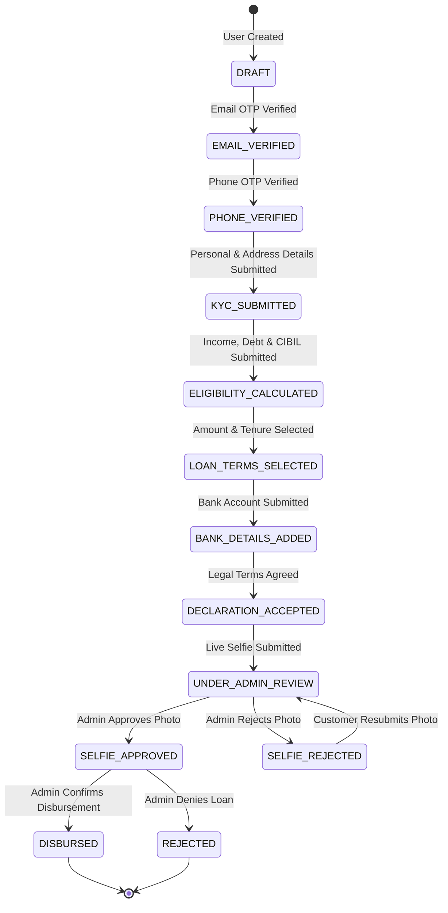

# EZFinanz Personal Loan Application Solution - Product Specification

## 1. Executive Summary

**EZFinanz** is a digital personal loan application platform designed to deliver an end-to-end loan application, verification, underwriting, and disbursement workflow. The platform serves two primary personas:
1. **Customers**: Individuals seeking personal loans through a 10-step digital application journey.
2. **Admins / Loan Officers**: Financial personnel who audit customer data, verify identity/selfie uploads, manage approval workflows, and trigger disbursement.

This specification outlines the business rules, state transitions, domain logic, eligibility algorithms, and system requirements for building a production-grade EZFinanz loan application web application.

---

## 2. Target Personas & User Roles

| Role | Access Level | Key Capabilities |
| :--- | :--- | :--- |
| **Customer** | Authenticated User | Sign up/login, verify email & phone via OTP, submit KYC, check eligibility, customize & select EMI/tenure, enter bank details, sign declaration, capture/upload live selfie, track application timeline. |
| **Admin** | Authenticated Admin | Access admin dashboard, search/filter applications by stage/status, inspect full 10-stage customer journey, audit submitted identity documents & selfie, approve or reject selfie (with reason), confirm final disbursement. |
| **System** | Background Service | Auto-calculate Debt-to-Income (DTI), evaluate credit eligibility tier, calculate EMI breakdown & exact Internal Rate of Return (IRR), transition state machine, log audit events. |

---

## 3. End-to-End Application Workflow & Application State Machine

### 3.1 State Machine Lifecycle Diagram

### 3.2 State Definitions

| State Name | Trigger Event | Allowed Next States | Description |
| :--- | :--- | :--- | :--- |
| `DRAFT` | Customer registration via Email/Phone/OAuth | `EMAIL_VERIFIED` | Account created, contact verification pending. |
| `EMAIL_VERIFIED` | Email OTP verified successfully | `PHONE_VERIFIED` | Email verified; phone OTP pending. |
| `PHONE_VERIFIED` | Phone OTP verified successfully | `KYC_SUBMITTED` | Both email and phone verified; KYC form enabled. |
| `KYC_SUBMITTED` | Identity info (PAN/Aadhaar) submitted | `ELIGIBILITY_CALCULATED` | Basic personal and address details stored. |
| `ELIGIBILITY_CALCULATED` | Financial details & credit score evaluated | `LOAN_TERMS_SELECTED` | Eligibility engine run; max loan & risk tier calculated. |
| `LOAN_TERMS_SELECTED` | Tenure & amount selected by customer | `BANK_DETAILS_ADDED` | EMI schedule, charges, and IRR locked. |
| `BANK_DETAILS_ADDED` | Account number, IFSC, holder name submitted | `DECLARATION_ACCEPTED` | Bank details stored and validated via IFSC format check. |
| `DECLARATION_ACCEPTED` | T&C and legal consent checked | `UNDER_ADMIN_REVIEW` | Customer agreed to credit check & terms. |
| `UNDER_ADMIN_REVIEW` | Live camera selfie uploaded by customer | `SELFIE_APPROVED`, `SELFIE_REJECTED` | Final customer step submitted. Awaiting admin review. |
| `SELFIE_REJECTED` | Admin rejects photo with rejection reason | `UNDER_ADMIN_REVIEW` | Customer notified to re-capture selfie. |
| `SELFIE_APPROVED` | Admin approves submitted photo | `DISBURSED`, `REJECTED` | Application ready for final disbursement execution. |
| `DISBURSED` | Admin clicks "Confirm Disbursement" | Terminated State | Loan agreement finalized and payout reference generated. |
| `REJECTED` | Admin rejects application permanently | Terminated State | Loan application closed and archived. |

---

## 4. Detailed Customer Journey (10 Steps)

### Step 1: Sign-Up & Authentication
- **Options**:
  1. Email & Password registration (with bcrypt hashing, min 8 chars, 1 number, 1 special char).
  2. Phone number registration (with simulated SMS OTP).
  3. Google OAuth simulation (1-click social sign-in mock).
- **Outcome**: Creates user record and initial loan application record in `DRAFT` state.

### Step 2: Email & Phone Verification
- **Email Verification**: User receives a 6-digit OTP (or verification link). Simulated system generates code (e.g. `123456` or auto-displayed toast in demo mode).
- **Phone Verification**: User receives 6-digit SMS OTP on mobile number.
- **Rule**: Both verifications must pass before proceeding to KYC.

### Step 3: KYC Details Collection
- **Fields**: Full Name, Date of Birth (Age check: 21 to 60 years), Gender, Current Residence Address, City, State, Pincode.
- **ID Verification**: ID Type selection (PAN Card / Aadhaar Card), ID Number, and optional ID Document image upload.
- **Simulation**: Mock automated OCR / PAN verification returning "PAN Verified & Matched".

### Step 4: Loan Eligibility Engine
- **Financial Inputs**:
  - Net Monthly Income (₹)
  - Requested Loan Amount (₹)
  - Self-Reported or Auto-Fetched CIBIL / Credit Score (300 to 900)
  - Existing Monthly Obligations / Debts (₹)
  - Employer Name & Designation
- **Logic & Classification**:
  - Calculates Debt-To-Income Ratio (DTI).
  - Determines eligibility status: **Eligible**, **Partially Eligible**, or **Not Eligible**.
  - Displays dynamic feedback, maximum approved loan limit, and recommended tenure options.

### Step 5: EMI & Loan Term Customization
- **Customer Controls**: Interactive slider/input for Loan Amount (capped at Max Approved Limit) and Tenure (6, 12, 18, 24, 36 months).
- **Real-Time Financial Calculations**:
  - **Applicable Annual Interest Rate (APR)**: Based on credit score tier (12% to 24% per annum).
  - **Processing Fee**: 2.0% of principal (min ₹1,000).
  - **GST on Processing Fee**: 18% of Processing Fee.
  - **Documentation Charges**: Flat ₹500.
  - **Total Deductible Charges**: Processing Fee + GST + Documentation Fee.
  - **Net Disbursement Amount**: Loan Amount - Total Deductible Charges.
  - **Monthly EMI**: Exact reducing-balance EMI formula.
  - **Total Interest**: (Monthly EMI * Tenure) - Loan Amount.
  - **Total Repayment Amount**: Monthly EMI * Tenure.
  - **Internal Rate of Return (IRR)**: Monthly & Annualized yield calculated via Newton-Raphson numerical algorithm taking into account Net Disbursement as Cash Outflow at $T_0$ and monthly EMIs as Cash Inflows ($T_1 \dots T_n$).

### Step 6: Bank Account Addition
- **Fields**: Account Holder Name, Bank Account Number, Confirm Account Number, IFSC Code, Bank Name, Account Type (Savings / Current).
- **Simulation**: Mock "Penny Drop" verification (instant ₹1 deposit test) validating account ownership.

### Step 7: Confirmation of Declaration
- **Content**: Standard legal terms, credit check consent, auto-debit consent, truthfulness undertaking.
- **Action**: Mandatory checkbox tick + digital consent submission with timestamp and IP log.

### Step 8: Live Selfie / Photo Verification
- **Feature**: Live web camera feed preview with capture photo button OR file dropzone upload fallback.
- **Validation**: Image file format validation (JPEG/PNG), max size 5MB.
- **Outcome**: Updates application stage to `UNDER_ADMIN_REVIEW`.

### Step 9: Application Status & Timeline Tracking
- **Dashboard View**: Customer tracks progress across a visual timeline stepper showing current state (`Submitted` -> `Under Review` -> `Approved` -> `Disbursed`).

### Step 10: Final Disbursement Receipt
- **View**: Upon admin confirmation, customer receives a disbursement summary page featuring reference transaction ID, payout date, repayment start date, and downloadable Loan Schedule summary.

---

## 5. Detailed Admin Journey

### Admin Dashboard & Auditing Flow
1. **Admin Login**: Separate or shared login page routing user to `/admin/dashboard` based on `role: "admin"`.
2. **Applications Overview Table**:
   - Filterable by Status (`ALL`, `UNDER_ADMIN_REVIEW`, `SELFIE_APPROVED`, `SELFIE_REJECTED`, `DISBURSED`, `REJECTED`).
   - Columns: Applicant Name, Application ID, Requested Loan Amount, Selected Tenure, CIBIL Score, Current Stage, Submitted Date/Time, Action button ("Review").
3. **Full Application Journey Modal / Drawer**:
   - Tabbed / Stepper view displaying complete submitted data:
     - Account & Verification Status (Email & Phone verified timestamps)
     - KYC Identity & ID Document preview
     - Income & Eligibility score, DTI %, Approved limit
     - Selected EMI terms, Rate of Interest, Net Disbursement, IRR %
     - Bank Account Details & IFSC validation status
     - Signed Declaration log
     - High-resolution Live Selfie image viewer
4. **Selfie Review Action**:
   - **Approve**: Sets selfie status to Approved, enables "Confirm Disbursement".
   - **Reject**: Opens modal for mandatory Rejection Reason (e.g. "Blurry photo", "Face not matching ID document", "Poor lighting"). Status becomes `SELFIE_REJECTED`. Customer can re-upload selfie.
5. **Disbursement Execution**:
   - Admin clicks "Confirm Disbursement".
   - System generates UTR / Transaction Reference number, locks application to `DISBURSED`, updates disbursement timestamp, and simulates SMS/Email notification to customer.

---

## 6. Business Rules & Financial Calculation Specifications

### 6.1 Debt-to-Income (DTI) & Eligibility Algorithm

$$\text{Monthly Income} = \frac{\text{Annual Income}}{12} \quad (\text{if submitted annually})$$

$$\text{Total Monthly Obligation} = \text{Existing Monthly Debts} + \text{Estimated Monthly EMI}$$

$$\text{DTI Ratio (\%)} = \left( \frac{\text{Total Monthly Obligation}}{\text{Monthly Income}} \right) \times 100$$

#### Interest Rate & Risk Tier Matrix

| CIBIL Score Range | Risk Rating | Base Interest Rate (APR) | Max Loan Multiplier (x Monthly Net) | Max DTI Cap |
| :--- | :--- | :--- | :--- | :--- |
| **750 - 900** | Excellent | 12.5% p.a. | 10x Monthly Income (Max ₹10,000,000) | 55% |
| **700 - 749** | Good | 15.0% p.a. | 8x Monthly Income (Max ₹750,000) | 50% |
| **650 - 699** | Fair | 18.5% p.a. | 5x Monthly Income (Max ₹500,000) | 45% |
| **300 - 649** | High Risk / Poor | Ineligible | 0x | N/A |

#### Decision Rules
1. **ELIGIBLE**: CIBIL $\ge 750$, DTI $\le 50\%$, Net Monthly Income $\ge$ ₹25,000.
2. **PARTIALLY ELIGIBLE**: CIBIL between 650 and 749 OR DTI between 51% and 60%. Loan amount is capped at 60% of requested amount or 5x monthly income.
3. **NOT ELIGIBLE**: CIBIL $< 650$ OR DTI $> 60\%$ OR Net Monthly Income $< ₹25,000$.

### 6.2 Reducing Balance EMI Formula

$$E = P \cdot \frac{r(1+r)^n}{(1+r)^n - 1}$$

- $P$ = Principal Loan Amount Selected
- $r$ = Monthly Interest Rate $= \frac{\text{Annual Interest Rate}}{12 \times 100}$
- $n$ = Tenure in months ($6, 12, 18, 24, 36$)

### 6.3 Fee Structure & Net Disbursement

$$\text{Processing Fee} = \max(0.02 \times P, 1000)$$

$$\text{GST} = 0.18 \times \text{Processing Fee}$$

$$\text{Documentation Fee} = 500$$

$$\text{Total Deductions} = \text{Processing Fee} + \text{GST} + \text{Documentation Fee}$$

$$\text{Net Disbursement Amount} = P - \text{Total Deductions}$$

### 6.4 Internal Rate of Return (IRR) Calculation

The Internal Rate of Return (IRR) represents the actual effective yield of the loan considering upfront deductions.

Let Cash Outflow at $t=0$ be $C_0 = -\text{Net Disbursement Amount}$.
Let Cash Inflow at $t=1 \dots n$ be $C_t = +E$ (Monthly EMI).

We solve for monthly rate $m$ using the Newton-Raphson numerical solver:

$$f(m) = C_0 + \sum_{t=1}^{n} \frac{E}{(1+m)^t} = 0$$

$$f'(m) = -\sum_{t=1}^{n} \frac{t \cdot E}{(1+m)^{t+1}}$$

$$m_{k+1} = m_k - \frac{f(m_k)}{f'(m_k)}$$

Iterate until $|m_{k+1} - m_k| < 10^{-7}$ or max 100 iterations.
Once monthly IRR $m$ is found:
- **Nominal Annualized IRR** = $m \times 12 \times 100\%$
- **Effective Annualized Rate (EAR / Effective IRR)** = $\left( (1+m)^{12} - 1 \right) \times 100\%$

---

## 7. Simulation & External Integrations Strategy

To ensure zero reliance on paid external APIs while maintaining full fidelity:
1. **SMS / Email OTP Simulation**:
   - Backend auto-generates 6-digit OTP (e.g. `123456` or random).
   - Backend logs OTP to server console and returns it in a debug header/response flag for instant UI auto-fill during testing.
2. **CIBIL Score Verification**:
   - Allows manually entering credit score or clicking "Auto-Fetch Simulated CIBIL" which generates realistic scores (300-850) based on ID input.
3. **KYC & PAN Verification**:
   - Mock algorithm validates PAN pattern (`[A-Z]{5}[0-9]{4}[A-Z]{1}`) and Aadhaar pattern (`[0-9]{12}`).
4. **Bank Account Penny Drop**:
   - Validates IFSC format (`[A-Z]{4}0[A-Z0-9]{6}`) and simulates instant account verification status.
5. **Selfie Capture & Storage**:
   - Uses HTML5 WebRTC `navigator.mediaDevices.getUserMedia` for real camera selfie capture, with file upload fallback using `multer` storing files in static uploads directory.

---

## 8. Non-Functional Requirements (NFRs)

1. **Security**:
   - JWT authentication tokens with 24-hour expiration stored securely.
   - Passwords hashed with `bcrypt` (salt rounds = 10).
   - Role-Based Access Control (RBAC) middleware verifying `admin` role on admin endpoints.
   - Input sanitization and file extension/MIME verification for uploaded images.
2. **Performance**:
   - Initial page render $< 1.5$ seconds.
   - EMI and IRR client-side recalculation $< 10$ milliseconds.
3. **Responsiveness**:
   - 100% mobile-friendly responsive layout built with Tailwind CSS (supported from 320px screen width up to 4K displays).
